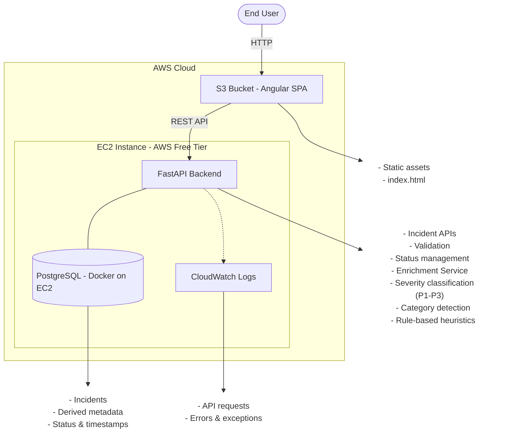

# erp-incident-triage-portal
The ERP Incident Triage Portal is a small project that replicates ERP incident system.
It allows users to submit ERP incidents, automatically enriches them openai, and provides a simple UI to view and manage incidents.

The system is intentionally kept simple, predictable, and free-tier friendly, while remaining extensible for future growth.

The working portal can be accessed at http://erp-incident-triage-portal.s3-website.ap-south-1.amazonaws.com/

Note (HTTPS + Domain): This demo uses an HTTP URL (S3 static website hosting). For a production-friendly setup (HTTPS + custom domain for UI and APIs), see `Assumptions Made` and `Future Improvements`.

# How To run locally

Use Docker + Docker Compose to run the app locally with the provided `compose.yml`.

```bash
docker compose up --build 
OR
docker compose up -d
```

To stop and remove containers:

```bash
docker compose down
```

Note (Windows): Use Docker Desktop or WSL2 for Docker (recommended) and run the `docker compose` commands from your WSL terminal.
Note: Running without Docker is possible, but you’ll need to install and run PostgreSQL locally and execute the required DB setup/init steps (schema, extensions, seed data). It’s typically faster and less error-prone to run the full stack with Docker.

If you want to run the UI only on your machine and connect it to the hosted EC2 backend, start the Angular dev server in production config (uses `frontend/src/environments/environment.prod.ts`):

```bash
cd frontend
npm install
npx ng serve --configuration production
```


# High-Level Architecture

The application follows a cleanly separated frontend and backend architecture, with each component deployed to the environment that best fits its runtime characteristics.



## Architecture Rationale
### Frontend (Angular)

Built using Angular standalone components and modern Angular features.
Compiled into static assets and hosted on Amazon S3.

Why S3
Frontend is static and does not require compute.
Zero operational overhead.
Fully compatible with AWS Free Tier.
Aligns with production best practices.

### Backend (FastAPI)

Implemented as a REST API using FastAPI.
Deployed as a long-running service on a single EC2 free-tier instance.

Handles:
Incident creation
Incident retrieval
Status updates
Orchestration of enrichment logic

Why EC2 instead of Lambda?
Predictable latency (no cold starts).
Easier debugging and observability.
Better fit for a CRUD-centric, low-traffic MVP.
Avoids unnecessary operational complexity for this stage.

Incident Enrichment
Enrichment is performed synchronously during incident creation.
Uses deterministic, rule-based heuristics to derive:
Severity (P1 / P2 / P3)
Category (e.g., Data Issue, Integration Failure, Access Issue)
Derived values are persisted and not recomputed on reads.

Rationale
Simple, explainable, and predictable.
Easy to extend later with async processing or ML-based enrichment.

### Database (PostgreSQL)

PostgreSQL is used to store incidents and derived metadata.
Runs on the same EC2 instance using Docker for simplicity.
Relational modeling fits incident lifecycle and querying needs.

Rationale
Clear data modeling.
Easy filtering by severity, module, and status.
Co-location is acceptable for MVP scale and keeps cost at zero.
Clean migration path to RDS if the system grows.

### Observability (CloudWatch)

Application logs are sent to Amazon CloudWatch.

Includes:
API request logs
Enrichment decisions
Error traces
Rationale
Production-grade observability.

Fully within free-tier limits.

# Assumptions Made

To keep the scope focused and aligned with the goals of this MVP, the following assumptions were made:

## Users & Access

Authentication and authorization are out of scope for this MVP.

Currently, there is only one user entered by default in the db (name:'System Admin', email: 'admin@erp.local', role: 'ADMIN').

Role-based access control is not required for demonstrating triage functionality.

## Incident Enrichment

Incident enrichment is deterministic and synchronous.

Category, Summary and Suggetsed-actions are derived using openai model.

Enrichment logic is assumed to be lightweight and fast enough to run inline with request processing.

## Data & Persistence

PostgreSQL is sufficient for storing incidents and derived metadata.

Data volume is small enough to run the database on the same EC2 instance as the backend.

Strong transactional guarantees are not required beyond basic consistency.

## Usage & Scale

The system is expected to handle low traffic and small data volumes.

Incidents are primarily submitted by humans through the UI rather than automated systems.

There are no strict latency or throughput requirements at this stage.

## Infrastructure

AWS Free Tier constraints apply.

High availability, multi-AZ deployments, and auto-scaling are not required for this exercise.

The system prioritizes simplicity and debuggability over maximum resilience.

## Frontend Hosting

The Angular frontend is hosted as a static site using S3 static website hosting.

Client-side routing is supported by redirecting 404s to index.html.

HTTPS, a custom domain name, CDN caching, and edge optimization are considered optional for the MVP.

For simplicity, the MVP can use S3 “static website hosting” endpoints (HTTP-only) and expose the backend APIs via a plain HTTP endpoint (IP/DNS) during development/demo.


# Future Improvements

With additional time, scale, or production requirements, the system could be evolved in the following ways:

## Backend & Architecture

Move PostgreSQL to Amazon RDS for better durability, backups, and scalability.

Introduce async processing for incident enrichment using queues or event-driven workflows.

Extract enrichment logic into separate services or serverless functions as complexity grows.

Add API rate limiting and request validation at the gateway level.

Add pagination, filtering, sorting on the backend

Add more logs in backend

## Frontend & UX

Add badge for the status.

Instead of dropdown to update the status of the incident, add popup or allow to edit the status on incident-detail page

Improve error handling and user feedback.

Add pagination for large incident lists from BE

## Security & Access Control

Introduce authentication using OAuth or enterprise SSO.

Implement role-based access control (RBAC).

Secure API endpoints with proper authorization policies.

## Infrastructure & Deployment

Serve the UI over HTTPS with a custom domain and redirect HTTP → HTTPS.

Expose the backend APIs via an HTTPS domain (e.g., ALB/Nginx reverse-proxy with TLS), avoid hard-coded IPs, and update the frontend `apiBaseUrl` to the HTTPS API endpoint to prevent browser mixed-content issues.

Introduce CI/CD pipelines for automated build and deployment.

Enable structured monitoring and alerting using CloudWatch metrics and alarms.

Migrate parts of the system to serverless (Lambda) where workload patterns justify it.

## Reliability & Observability

Add health checks and uptime monitoring.

Introduce structured tracing and correlation IDs.
